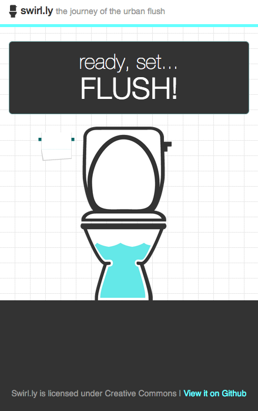

SWIRL.LY
====================

the journey of the urban flush

---------------------

In the wild at swirl.ly, and with data to support San Francisco and Austin. There's a blog post about it here: https://medium.com/p/dff5f372d77c

How do I add and find data for my city?
---------------------
coming soon, for now just email me emily@emilyville.com

Instructions on how to install and deploy
---------------------
coming soon, I promise.

It looks like this: 

---------------------
Creative Commons Attribution-NonCommercial-ShareAlike 3.0 Unported License
http://creativecommons.org/licenses/by-nc-sa/3.0/deed.en_US
(http://i.creativecommons.org/l/by-nc-sa/3.0/88x31.png "Creative Commons License") 
This work is licensed under a href="http://creativecommons.org/licenses/by-nc-sa/3.0/deed.en_US
